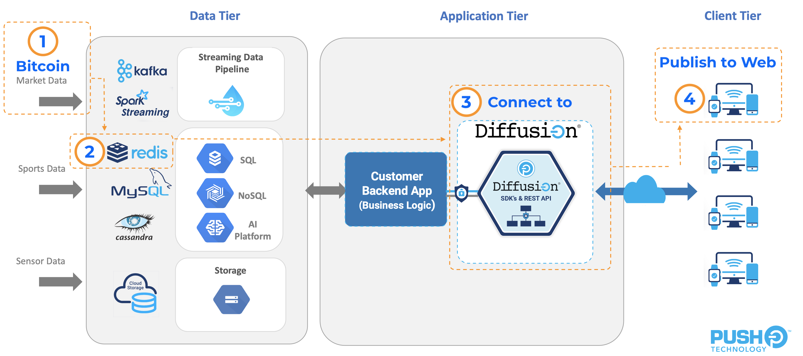
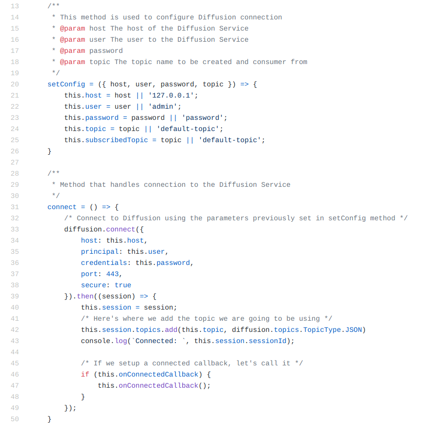
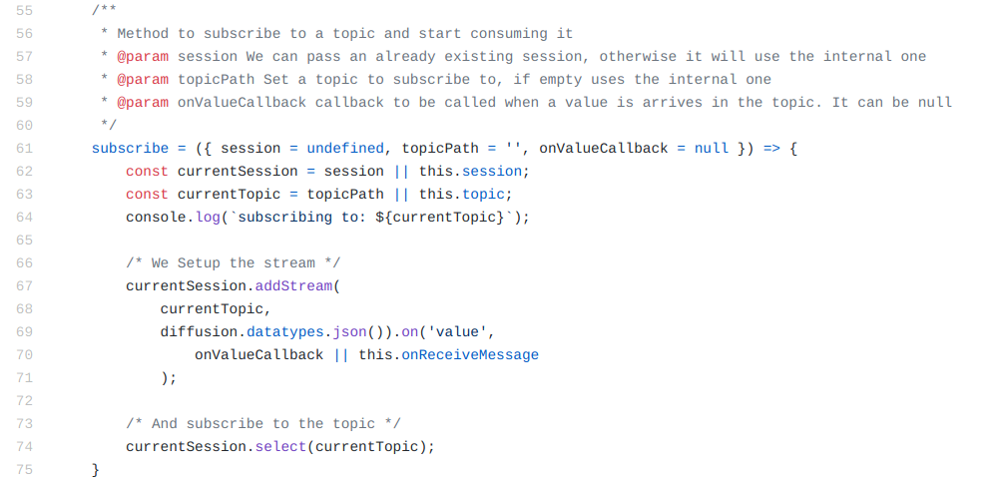

# Extend Redis with Diffusion

Introduction to Diffusion Real-Time Event Stream through a simple application using [Diffusion](https://www.pushtechnology.com/product-overview) Cloud and Redis Pub/Sub Server.

This JavaScript code example will help you publish external data on real-time from a public API to Redis, consume from it and transform data on-the-fly via our powerful [Topic Views](https://docs.pushtechnology.com/docs/6.5.2/manual/html/designguide/data/topictree/topic_views.html) feature. You can also use other programming languages from our [SDKs](https://docs.pushtechnology.com/#sdks), including iOS, Android, C, .NET, and more. 

# What this tutorial does
## General Schema

## Market data
For the purposes of this tutorial, we are going to be using the [Coindesk API](https://api.coindesk.com/v1/bpi/currentprice.json) to retrieve Bitcoin current value, in USD, Euros and GBP. 
We connect the that API and as we receive it's response, we feed it into the Data Tier (Redis Service).
## Data Tier
In Redis we created a Topic to stream that data through, and we created a Redis Client to consume from the same channel. The client then shows a chart displaying the values consumed from Redis.  
## Application Tier
This is where data collected in redis is, published to Diffusion.
### Redis publisher
The redis publisher, which is consuming data from the Redis Topic, in turn, publishes the same content to a Topic in Diffusion.
### Diffusion Server
This is where the magic happens, data received can be Enriched and Fine Grained thanks to [Topic Views](https://docs.pushtechnology.com/docs/6.5.2/manual/html/designguide/data/topictree/topic_views.html), allowing Clients to consume only relevant data and increasing data efficiency.
## Client Tier
Finally we have a Diffusion client, consuming from the Diffusion Topic and showing in the chart the values it received.

# The code in Action

## Connecting to diffusion
1. Connecting is very easy, this is the function a consumer class in JS calls to connect. Read the comments in the function to understand what it does.


2. After connecting, in order to start consuming from the Topic, we must subscribe to it, using the following function.


# Pre-requisites

*  Download our code examples or clone them to your local environment:
```
 git clone https://github.com/pushtechnology/tutorials/
```
* A Diffusion service (Cloud or On-Premise), version 6.6 (update to latest preview version) or greater. Create a service [here](https://management.ad.diffusion.cloud/).
* Follow our [Quick Start Guide](https://docs.pushtechnology.com/quickstart/#diffusion-cloud-quick-start) and get your service up in a minute!

# Running it
1. Requirements:
    1. docker and docker-compose
    2. nodejs and nodemon
2. From the root of the project, run: docker-compose up -d -> To start the Web Server and the Redis Server.
3. From the root of the project run:
    1. nodemon js/redis-server/redis-server.js -> To start the redis service
4. In your browser, go to: localhost:8008.
5. There you go! 
    1. First start listening to the API and running the Redis Server, on the left.
    2. Then connect to Diffusion on the right
    3. You'll see both charts being updated. Check the size of the data received by the charts and realize how much data you can save with Diffusion!