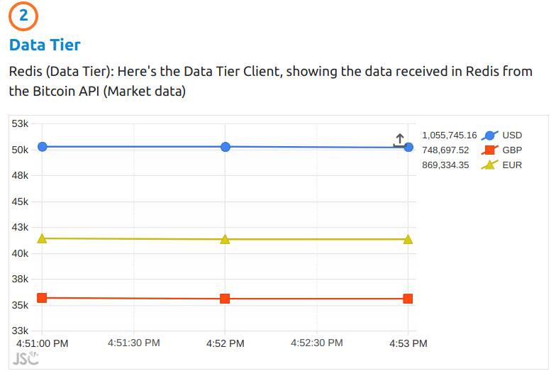
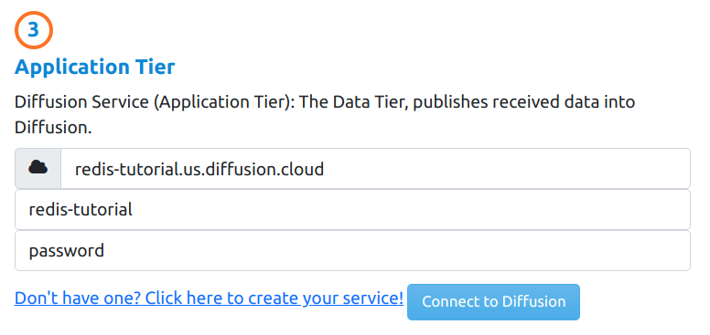

# Extend Redis with Diffusion

Introduction to Diffusion Real-Time Event Stream through a simple application using [Diffusion](https://www.pushtechnology.com/product-overview) Cloud and Redis Pub/Sub Server.

This JavaScript code example will help you publish external data on real-time from a public API to Redis, consume from it and transform data on-the-fly via our powerful [Topic Views](https://docs.pushtechnology.com/docs/6.5.2/manual/html/designguide/data/topictree/topic_views.html) feature. You can also use other programming languages from our [SDKs](https://docs.pushtechnology.com/#sdks), including iOS, Android, C, .NET, and more. 

# What this tutorial does
## General Schema

## Market data
  
For the purposes of this tutorial, we are going to be using the [Coindesk API](https://api.coindesk.com/v1/bpi/currentprice.json) to retrieve Bitcoin current value, in USD, Euros and GBP. 
We connect the that API and as we receive it's response, we feed it into the Data Tier (Redis Service).
## Data Tier
  
In Redis we created a Topic to stream that data through, and we created a Redis Client to consume from the same channel. The client then shows a chart displaying the values consumed from Redis.  
## Application Tier
  
This is where data collected in redis is, published to Diffusion.
### Redis publisher
The redis publisher, which is consuming data from the Redis Topic, in turn, publishes the same content to a Topic in Diffusion.
### Diffusion Server
This is where the magic happens, data received can be Enriched and Fine Grained thanks to [Topic Views](https://docs.pushtechnology.com/docs/6.5.2/manual/html/designguide/data/topictree/topic_views.html), allowing Clients to consume only relevant data and increasing data efficiency.
## Client Tier
  
Finally we have a Diffusion client, consuming from the Diffusion Topic and showing in the chart the values it received.

# The code in Action
## Connecting to diffusion
1. Connecting is very easy, this is the function a consumer class in JS calls to connect. Read the comments in the function to understand what it does.
```javascript
/**
     * This method is used to configure Diffusion connection
     * @param host The host of the Diffusion Service
     * @param user The user to the Diffusion Service
     * @param password
     * @param topic The topic name to be created and consumer from
     */
    setConfig = ({ host, user, password, topic }) => {         
        this.host = host || '127.0.0.1';
        this.user = user || 'admin';
        this.password = password || 'password';
        this.topic = topic || 'default-topic';
        this.subscribedTopic = topic || 'default-topic';
    }

    /**
     * Method that handles connection to the Diffusion Service      
     */
    connect = () => {
        /* Connect to Diffusion using the parameters previously set in setConfig method */
        diffusion.connect({
            host: this.host,            
            principal: this.user,
            credentials: this.password,                       
            port: 443,
            secure: true
        }).then((session) => {
            this.session = session;
            /* Here's where we add the topic we are going to be using */
            this.session.topics.add(this.topic, diffusion.topics.TopicType.JSON)            
            console.log(`Connected: `, this.session.sessionId);

            /* If we setup a connected callback, let's call it */
            if (this.onConnectedCallback) {
                this.onConnectedCallback();
            }            
        });
    }
```

2. After connecting, in order to start consuming from the Topic, we must subscribe to it, using the following function.
```javascript
/**
     * Method to subscribe to a topic and start consuming it
     * @param session We can pass an already existing session, otherwise it will use the internal one
     * @param topicPath Set a topic to subscribe to, if empty uses the internal one
     * @param onValueCallback callback to be called when a value is arrives in the topic. It can be null
     */
    subscribe = ({ session = undefined, topicPath = '', onValueCallback = null }) => {
        const currentSession = session || this.session;
        const currentTopic = topicPath || this.topic;
        console.log(`subscribing to: ${currentTopic}`);
        
        /* We Setup the stream */
        currentSession.addStream(
            currentTopic,
            diffusion.datatypes.json()).on('value',
                onValueCallback || this.onReceiveMessage
            );

        /* And subscribe to the topic */
        currentSession.select(currentTopic);
    }
```

3. This is the consumer class, it uses the Diffusion Client's functions, described above, to get the Web Client going.

```javascript
/**
     * This is the event handler when the Connect to Diffusion button is clicked
     * @param {*} evt 
     */
    onDiffusionConnectBtnClicked = evt => {
        console.log('Connecting to Diffusion');
        evt.preventDefault();

        // Instatiate Diffusion's Client
        // We send the connect and on message callbacks to handle those events
        this.diffusionClient = new Diffusion(this.onConnectedToDiffusion, this.onDiffusionMessage);
        
        // Set diffusion config
        this.diffusionClient.setConfig({
            host: this.hostEl.value,
            user: this.userEl.value,
            password: this.passwordEl.value,
            topic: this.topic
        });

        // And connect to it
        this.diffusionClient.connect();
    }

    /**
     * This is the callback, Diffusion client calls after connection
     */
    onConnectedToDiffusion = () => {
        console.log('connected to diffusion');
        // Once we're connected, subscribe to the topic we specified when connecting to Diffusion service
        // We're not sending any parameters because we already set those when calling the setConfig function in the previous method.
        this.diffusionClient.subscribe({}); //Subscribe to Diffusion's topic
    }

    /**
     * This is the callback the Diffusion Client calls when a message is received
     * We update the Client Tier chart with this info.
     * @param {*} message 
     */
    onDiffusionMessage = message => {
        console.log('on Diffusion message', message);
        // This message came from Diffusion! Feed Diffusion's Chart
        this.updateChart(message, this.diffusionChart);
    }
```

# Pre-requisites

*  Download our code examples or clone them to your local environment:
```
 git clone https://github.com/pushtechnology/tutorials/
```
* A Diffusion service (Cloud or On-Premise), version 6.6 (update to latest preview version) or greater. Create a service [here](https://management.ad.diffusion.cloud/).
* Follow our [Quick Start Guide](https://docs.pushtechnology.com/quickstart/#diffusion-cloud-quick-start) and get your service up in a minute!

# Running it
1. Requirements:
    1. docker and docker-compose
    2. nodejs and nodemon
2. From the root of the project, run: docker-compose up -d -> To start the Web Server and the Redis Server.
3. From the root of the project run:
    1. nodemon js/redis-server/redis-server.js -> To start the redis service
4. In your browser, go to: localhost:8008.
5. There you go! 
    1. First start listening to the API and running the Redis Server, on the left.
    2. Then connect to Diffusion on the right
    3. You'll see both charts being updated. Check the size of the data received by the charts and realize how much data you can save with Diffusion!