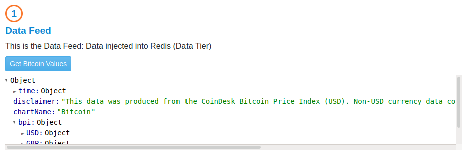

# Extend Redis with Diffusion

Introduction to Diffusion Real-Time Event Stream through a simple application using [Diffusion](https://www.pushtechnology.com/product-overview) Cloud and Redis Pub/Sub Server.

This JavaScript code example will help you publish external data on real-time from a public API to Redis, consume from it and transform data on-the-fly via our powerful [Topic Views](https://docs.pushtechnology.com/docs/6.5.2/manual/html/designguide/data/topictree/topic_views.html) feature. You can also use other programming languages from our [SDKs](https://docs.pushtechnology.com/#sdks), including iOS, Android, C, .NET, and more. 

# What this tutorial does
## General Schema

## Market data
  
For the purposes of this tutorial, we are going to be using the [Coindesk API](https://api.coindesk.com/v1/bpi/currentprice.json) to retrieve Bitcoin current value, in USD, Euros and GBP. 
We connect the that API and as we receive it's response, we feed it into the Data Tier (Redis Service).
## Data Tier
  
In Redis we created a Topic to stream that data through, and we created a Redis Client to consume from the same channel. The client then shows a chart displaying the values consumed from Redis.  
## Application Tier
  
This is where data collected in redis is, published to Diffusion.
### Redis publisher
The redis publisher, which is consuming data from the Redis Topic, in turn, publishes the same content to a Topic in Diffusion.
### Diffusion Server
This is where the magic happens, data received can be Enriched and Fine Grained thanks to [Topic Views](https://docs.pushtechnology.com/docs/6.5.2/manual/html/designguide/data/topictree/topic_views.html), allowing Clients to consume only relevant data and increasing data efficiency.
## Client Tier
  
Finally we have a Diffusion client, consuming from the Diffusion Topic and showing in the chart the values it received.

# The code in Action

## How it works

### Redis and Web Servers
We use [docker](./redis-app/docker-compose.yaml) to setup and run a Redis Server and a Web Server to host the web application.  

### Redis NodeJS Server
To interface with the Redis Server, we built a NodeJS [Server](./redis-app/js/redis-server/redis-server.js). This App runs **server side** next to the Redis Server.

   1. The NodeJS Server will connect to the Redis Server and create and use a Topic, to stream data through. To perform this interaction, both **redisPublisher** and a **redisConsumer** clients are instantiated
   2. To communicate with the Web App (a client), it will open a connection to a WebSocket. We use port 3000.
   3. Every data that is consumed from the WebSocket is published to the Redis Server's Topic by the redisPublisher
   4. Every data consumed from Redis Server with the redisConsumer object is, in turn, published to the WebSocket.

This is the piece of code that represents that interaction:

```javascript
server.on('connection', function connection(ws) {
    // Message Received in Socket from webclient, and sent to redis
    ws.on('message', function (event) {
        console.log('Message from Websocket:', event);
        redisPublisher.publish(REDIS_CHANNEL, event);
    });

    // Message received from Redis, and sent through Websocket to Webclients
    redisSubscriber.on('message', function (channel, message) {
        console.log('Redis Subscriber: ', channel, message);
        ws.send(message);
    })
});
```

## The WebClient

The WebClient consists of three main Services:

[**CoindeskPoller**](./redis-app/js/services/CoindeskPoller.js): This Service interacts with [Coindesk](https://api.coindesk.com/v1/bpi/currentprice.json), by polling data from its API and publishing it to Redis.

```javascript
/**
* The function that handles the call to the API when polling
*/
callEndpoint = async () => {
    const response = await fetch(this.apiUrl);
    const contentLength = response.headers.get("content-length");
    const data = await response.json();
    // Show the data from the API in the response element
    const formatter = new JSONFormatter(data);
    this.apiResponseBodyEl.innerHTML = '';
    this.apiResponseBodyEl.appendChild(formatter.render());
    
    // Publish polled data to Redis
    this.redisService.publish(data);
}
```

[**RedisService**](./redis-app/js/services/RedisService.js): This Service acts as a bridge, receiving data from *CoindeskPoller* and publishing it to Diffusion. It also feeds data received from Coindesk into the Redis Chart. *RedisService* uses **WebSockets** to interact with the [**Redis NodeJS Server**](./redis-app/js/redis-server/redis-server.js), as explained before.

```javascript
/**
 * Add the websocket listener to listen for Redis Messages
 */
startListeningRedisWebSocket = () => {
    this.redisWebSocket.onmessage = ({ data }) => {
        this.message = JSON.parse(data); // Parse the data from Redis
        console.log('Data received from Redis: ', this.message);
        this.updateChart(this.message); // Feed the Redis graph with it
        
        // Publish received data to Diffusion
        this.publishToDiffusion(this.message);
    }
}
```

[**DiffusionService**](./redis-app/js/services/DiffusionService.js): This Service, in turn, receives data published by *RedisService* from the Diffusion Topic we've set up, and feeds Diffusion's Chart:

```javascript
/**
 * This is the callback the Diffusion Client calls when a message is received
 * We update the Client Tier chart with this info
 * @param {*} message 
 */
onDiffusionMessage = message => {
    console.log('on Diffusion message', message);
    // This message came from Diffusion! Feed Diffusion's Chart
    this.updateChart(message, this.diffusionChart);
}
```

## Connecting to diffusion

In the previous section, we described how the different Web Application Services interact. Now we'll describe, how the Diffusion Service interacts with the Diffusion Client to Consumer and Publish through it. Connecting is very easy, read the comments in code to understand what it does.

### Functions in DiffusionService

#### Connectig to Diffusion

```javascript
/**
 * This is the event handler when the Connect to Diffusion button is clicked
 * @param {*} evt 
 */
connect = (
    host, user, password, topic
) => {
    console.log('Connecting to Diffusion');        

    // Instantiate Diffusion's Client
    // We send the connect and on message callbacks to handle those events
    this.diffusionClient = new Diffusion(this.onConnectedToDiffusion, this.onDiffusionMessage);

    // Set Diffusion config
    this.diffusionClient.setConfig({
        host: host,
        user: user,
        password: password,
        topic: topic
    });

    // And connect to it
    this.diffusionClient.connect();
}

/**
 * This is the callback, Diffusion client calls after connection
 */
onConnectedToDiffusion = () => {
    console.log('connected to diffusion');
    // Once we're connected, subscribe to the topic we specified when connecting to Diffusion service
    // We're not sending any parameters because we already set those when calling the setConfig function in the previous method.
    this.diffusionClient.subscribe({}); //Subscribe to Diffusion's topic
}
```

#### Publishing to Diffusion

```javascript
/**
 * Publish to diffusion
 * @param {*} data 
 */
publish = data => {
    this.diffusionClient.publishData(data);
}
```
#### Consuming from Diffusion

```javascript
/**
 * This is the callback the Diffusion Client calls when a message is received
 * We update the Client Tier chart with this info
 * @param {*} message 
 */
onDiffusionMessage = message => {
    console.log('on Diffusion message', message);
    // This message came from Diffusion! Feed Diffusion's Chart
    this.updateChart(message, this.diffusionChart);
}
```

### Diffusion Client functions

```javascript
/**
     * This method is used to configure Diffusion connection
     * @param host The host of the Diffusion Service
     * @param user The user to the Diffusion Service
     * @param password
     * @param topic The topic name to be created and consumer from
     */
    setConfig = ({ host, user, password, topic }) => {         
        this.host = host || '127.0.0.1';
        this.user = user || 'admin';
        this.password = password || 'password';
        this.topic = topic || 'default-topic';
        this.subscribedTopic = topic || 'default-topic';
    }

    /**
     * Method that handles connection to the Diffusion Service      
     */
    connect = () => {
        /* Connect to Diffusion using the parameters previously set in setConfig method */
        diffusion.connect({
            host: this.host,            
            principal: this.user,
            credentials: this.password,                       
            port: 443,
            secure: true
        }).then((session) => {
            this.session = session;
            /* Here's where we add the topic we are going to be using */
            this.session.topics.add(this.topic, diffusion.topics.TopicType.JSON)            
            console.log(`Connected: `, this.session.sessionId);

            /* If we setup a connected callback, let's call it */
            if (this.onConnectedCallback) {
                this.onConnectedCallback();
            }            
        });
    }
```

After connecting, in order to start consuming from the Topic, we must subscribe to it, using the following function.

```javascript
/**
     * Method to subscribe to a topic and start consuming it
     * @param session We can pass an already existing session, otherwise it will use the internal one
     * @param topicPath Set a topic to subscribe to, if empty uses the internal one
     * @param onValueCallback callback to be called when a value is arrives in the topic. It can be null
     */
    subscribe = ({ session = undefined, topicPath = '', onValueCallback = null }) => {
        const currentSession = session || this.session;
        const currentTopic = topicPath || this.topic;
        console.log(`subscribing to: ${currentTopic}`);
        
        /* We Setup the stream */
        currentSession.addStream(
            currentTopic,
            diffusion.datatypes.json()).on('value',
                /* Call the function to process the received data */
                onValueCallback || this.onReceiveMessage
            );

        /* And subscribe to the topic */
        currentSession.select(currentTopic);
    }

    /* This is the function that processes data from Diffusion and calls the Consumer's Callback, if set. */
    onReceiveMessage = (topic, specification, newValue, oldValue) => {
        let message = newValue.get();
        message.receiveTime = new Date();
        console.log(`TOPIC - Receiving message for topic: ${topic}`, specification, newValue.get(), oldValue.get());
        if (this.onReceiveMessageCallback) {
            this.onReceiveMessageCallback(message, topic);
        }
    }
```

This is the function that Publishes to Diffusion:

```javascript
publishData(data) {        
    if (this.session) {
        /* Use the set SDK function to publish to a specific topic */
        this.session.topicUpdate.set(this.topic, diffusion.datatypes.json(), data);
    }
}
```

# Pre-requisites

*  Download our code examples or clone them to your local environment:
```
 git clone https://github.com/pushtechnology/tutorials/
```
* A Diffusion service (Cloud or On-Premise), version 6.6 (update to latest preview version) or greater. Create a service [here](https://management.ad.diffusion.cloud/).
* Follow our [Quick Start Guide](https://docs.pushtechnology.com/quickstart/#diffusion-cloud-quick-start) and get your service up in a minute!

# Running it
1. Requirements:
    1. docker and docker-compose
    2. nodejs and nodemon
2. From the root of the project, run: docker-compose up -d -> To start the Web Server and the Redis Server.
3. From the root of the project run:
    1. nodemon js/redis-server/redis-server.js -> To start the redis service
4. In your browser, go to: localhost:8008.
5. There you go! 
    1. First start listening to the API and running the Redis Server, on the left.
    2. Then connect to Diffusion on the right
    3. You'll see both charts being updated. Check the size of the data received by the charts and realize how much data you can save with Diffusion!